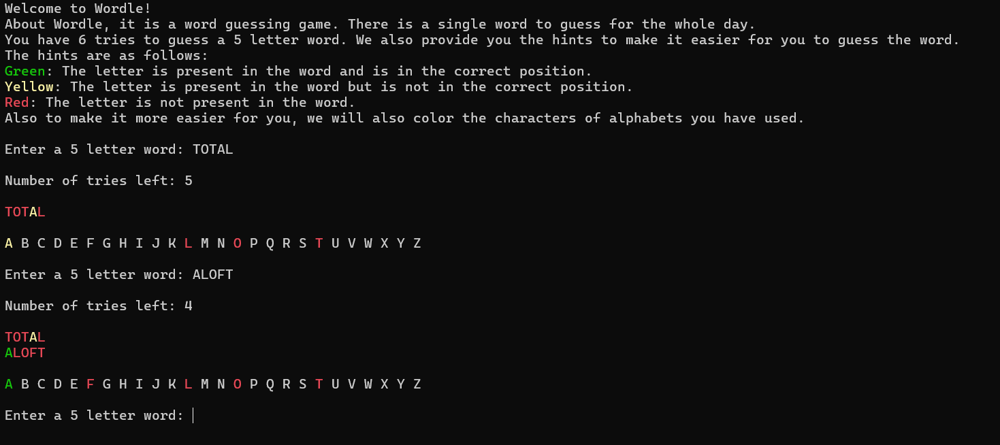

# Wordle

## Screenshots



This is a terminal based program atempting to recreate the wordle experience on the terminal.
About "Wordle". it is a popular word-guessing game where players try to guess a five-letter word by making guesses and receiving feedback on the correctness of their guesses.
I have attempted to replicated the complex ui of it by making the color of the character to a particular color.
Green for correct index and match, yellow for match but not correct index, red for no form of match.

## Table of Contents

- [Dependencies](#dependencies)
- [Building the program](#building-the-program)
- [Run Locally](#run-locally)
- [Features](#features)
- [File Structure](#file-structure)
- [Running Tests](#running-tests)
- [Demo](#demo)
- [Roadmap](#roadmap)
- [Made by](#by)

## Dependencies

### Only dependency is to have gcc in your machine

```bash {"id":"01J73WWF5YJ8C5DGMB9QTGP2QC"}
sudo apt-get install gcc
```

## Building the program

The below command will make a new executable/equivalent but you should have gcc installed

```bash {"id":"01J6WZ5475C5VKJF1Y4H4HQVXC"}
gcc wordle.c src/randomindex.c src/wordcheck.c src/hash.c src/color.c -Iinclude -o wordle -lm
```

## Run Locally

Clone the project

```bash {"id":"01J6WZ5476B3T2H75SW9AQ2Z83"}
  git clone https://github.com/smresponsibilities/Wordle
```

Go to the project directory

```bash {"id":"01J6WZ5476B3T2H75SWBA0ZHDY"}
  cd Wordle
```

Running the project

For linux

```bash {"id":"01J6WZ5476B3T2H75SWH9QRR4R"}
  chmod +x wordle.sh && ./wordle.sh
```

For windows, both commands are individually capable enough to make the program first command runs in git bash only

```bash {"id":"01J727AW1WJVX36T5N5GFD2B1V"}
sh wordle.sh
```

```bash {"id":"01J71YET5SHQ310X2ZJ5YMQYH0"}
 wordle.bat
```

## Features

- A single word for the whole day like the original
- Implemented a pseudo hash technique with no collisions
- Very modular
- Cross platform
- Attractive colors

## File Structure

- `wordle.c`: The main program file that is the entry point to the project.
- `test folder`: The folder that have the unit tests.
- `README.md`: The README file with project documentation.
- `include folder`: This contains the header files.
- `src folder`: This contains actual code of all the modular functions.
- `wordle.sh`: This contains the neccessary commands to build the program in Linux or in Windows by git bash.
- `wordle.bat`: This contains the neccessary commands to build the program in Windows.

## Running Tests

To run tests, go to the test directory on your machine

```bash {"id":"01J71Z0343QPEB3AYS0HMT7J3G"}
 cd test
```

To run the script on Windows , either run the below bat file or the next commands

```bash {"id":"01J6WZ5476B3T2H75SWKG4J3EM"}
.\test.bat 
```

```bash {"id":"01J6WZA2VB89ZTG611BNCZF8FD"}
gcc -I.. ../hash.c ../randomindex.c ../wordcheck.c testwordcheck.c testhash.c testrandom.c maintest.c -o maintest
.\maintest
```

To run the tests on Linux , run the following script

```bash {"id":"01J6WZC1VX396Z6Z4HH9SMTZEZ"}
chmod +x wordle.sh && ./wordle.sh
```

## Demo

Insert gif or link to demo

## Roadmap

- Transition from terminal to gui
- Add more words and slangs
- Using socket
- Doing more optimization and some more easter eggs
- Custom wordle

## Made by

- [@smresponsibilities](https://www.github.com/smresponsibilities)